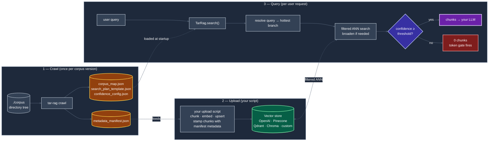

# tar-rag

**Author:** Vamsi Karnam

**License:** Apache License 2.0

**Topology-Aware Retrieval for RAG** — a vector-store-agnostic Python
library that adds structural navigation to any RAG pipeline.

---

## The idea

A corpus's existing topology is a zero-cost structural prior that can potentially replace an LLM router for retrieval, providing deterministic latency and a bounded hallucination surface.

## Description

Most RAG pipelines do flat top-K semantic search — every query scans the entire
vector space, mixing chunks from unrelated parts of the corpus and diluting the
top result. Many teams patch this with an extra LLM call that "routes" the query
to a filter; that costs tokens, adds latency, and can hallucinate filters that
don't exist.

`tar-rag` does the routing **with math instead of an LLM**. Before retrieval
starts it builds a topology map from your corpus's directory layout. At query
time it scores each branch of that map lexically against the query and produces
a **heat map**: the hottest branches go first, the rest cool off. ANN search
runs scoped to the hottest branch, and the filter only broadens if confidence
isn't high enough — exiting as soon as a confident answer is found. See [example](#high-level-example). 

> **Advantage.** No extra LLM call, no per-query token cost, sub-millisecond on the hot path, no hallucination, fully deterministic.

> **Environment.** `tar-rag` does **not** own embeddings, chunking, the vector store, or the LLM.
> It owns one thing: deciding where retrieval should start, and gating weak
> results before they ever reach your LLM.

> **Assumption.** Filesystem hierarchy correlates with semantic structure.
> This is the default state for documentation portals, source repos, SOP
> trees, and most mature internal knowledge bases — which is exactly the
> territory `tar-rag` is designed for.

---

## Use cases

1. Documentation portals
2. Source code repositories
3. Enterprise knowledge bases
4. Product manuals
5. SOP trees
6. API docs
7. Compliance repositories
8. Engineering archives
9. Filesystem-organized corpora
10. Code / documentation RAG


---

## System architecture

`tar-rag` is three user-driven steps that interconnect via two pieces of
shared state: the artifact files written by the crawl, and the vector
store populated by your upload script.



The crawl runs once per corpus version. The upload script runs once
after each crawl (or whenever your corpus changes). The query step runs
per user request and is the only one in the hot path. The full diagram
with the parallel fallback chain and per-attempt confidence scoring
lives in [`examples/how-to-guide.md`](examples/how-to-guide.md#architecture-detail).

---

## Install

```bash
pip install tar-rag
```

That's it. The default install includes every bundled vector-store adapter
(OpenAI, Pinecone, Qdrant, Chroma) and every file extractor (PDF, DOCX,
HTML, JSON, CSV, plaintext / source code) — `tar-rag` works out of the box
with whichever combination you reach for.

---

## High-level example

Suppose your corpus is laid out as `service/module/topic`:

```
/corpus
  /auth
    /oauth
    /sessions
  /billing
    /invoices
    /refunds
```

A user asks: *"How does the OAuth token refresh flow work?"*

A standard retriever embeds the query and runs ANN over **all** chunks —
billing included. 

However `tar-rag` does the following:

1. Scores branches lexically against the query → `auth=high, oauth=highest,
   billing=low` (the heat map above).
2. Filters the ANN search to `service=auth AND module=oauth` first.
3. If the top result clears the confidence threshold, returns. Otherwise
   broadens to just `service=auth`, then global, until something passes.
4. If nothing clears the threshold, returns **zero chunks** rather than
   forwarding weak ones to your LLM — that's the token gate.

```
# Example
query: "How does the OAuth token refresh flow work?"

  ┌────────────────────────────────────────────────────────────┐
  │ auth/oauth        ████████████   0.92   ← start ANN here   │
  │ auth/sessions     █████          0.41                      │
  │ billing/refunds   █              0.08                      │
  │ billing/invoices                 0.02                      │
  └────────────────────────────────────────────────────────────┘
                          │
                          ▼   scoped ANN; broaden only if needed
```

The vector store and embedding model are unchanged. The only addition is a
metadata filter derived deterministically from the query.

> See [`examples/how-to-guide.md`](examples/how-to-guide.md) for the quickstart
> and full Python API. See [`benchmarks/benchmark.md`](benchmarks/benchmark.md)
> for measured comparisons against an unfiltered baseline on real corpora.

---

## Supported file types

- **PDF** (`pypdf`)
- **DOCX** (`python-docx`)
- **HTML** (`.html`, `.htm` — stdlib `html.parser`)
- **Structured** (`.json`, `.csv` — stdlib)
- **Plaintext & source** (`.txt`, `.md`, `.rst`, `.py`, `.c`, `.cpp`, `.cc`,
  `.cxx`, `.h`, `.hpp`, `.js`, `.ts`, `.jsx`, `.tsx`, `.css`, `.java`,
  `.kt`, `.scala`, `.cs`, `.go`, `.rs`, `.rb`, `.php`, `.swift`, `.m`,
  `.mm`, `.lua`, `.pl`, `.sh`, `.dart`)

All extractors are pluggable via the `TextExtractor` interface — swap in
`pdfplumber`, `pymupdf`, `unstructured`, or anything custom by overriding
the registry. See [`examples/how-to-guide.md`](examples/how-to-guide.md#custom-extractors).

---

## Vector store invariance

`tar-rag` knows nothing about your chunker, embedder, or vector-store
internals. The contract is small: during upload you stamp each chunk with
metadata from `metadata_manifest.json`; at query time an adapter translates
`tar-rag`'s filter dict into your store's native filter format. Four adapters
ship in the box — OpenAI, Pinecone, Qdrant, Chroma — plus an in-memory
adapter for tests. Writing a custom one is a single class with a single
method; see
[`examples/how-to-guide.md`](examples/how-to-guide.md#custom-vector-store-adapter).

---

## Async support

Every public entry point has a native async counterpart: prefix the sync
method with `a` (e.g. `tar.search` → `tar.asearch`). Adapters whose
underlying client is sync-only still work asynchronously — the base class
runs them in a worker thread. Adapters with a native async client (e.g.
`openai.AsyncOpenAI`, `AsyncQdrantClient`) can override `asearch` for true
async I/O. Parallel fallback uses `asyncio.gather` on the async path and a
thread pool on the sync path; results are equivalent either way.

---

## Scalability

`tar-rag` solves *where* retrieval starts, not *which* vector store you
should use. It sits above your retrieval layer regardless of how that layer
is built:

- single vector spaces (Chroma, Qdrant, Pinecone, OpenAI Vector Stores)
- sharded / partitioned vector databases
- distributed retrieval systems
- multi-index routed setups (one index per product / language / tenant)
- graph + vector hybrids

Because the topology filter is just a metadata predicate, the orchestrator
scales with your vector store rather than against it — most stores apply
metadata pre-filters inside the ANN path, shrinking the candidate pool to
the relevant subtree rather than scanning the whole index. The crawl phase
is one-shot per corpus version; query-time overhead is sub-millisecond.

The crawl scales linearly with corpus size and is I/O-bound on file reads
and extractor cost. A retrieval cache keyed by
`(query, corpus_version, context_signature)` short-circuits repeated queries
without invalidation games — re-crawling a changed corpus updates the
version automatically.

### Mixed-depth corpora

The same crawl handles trees where different branches sit at different
depths — no preprocessing required. Given `--levels category,product,sub_type`,
a document at `general/overview.md` resolves with `product=None,
sub_type=None` and attaches at the `general` node; a document at
`instruments/triaxys/user_guide.md` resolves with `sub_type=None` and
attaches one level deeper; a document at
`instruments/datawell/operator_manual/dwr.md` fills all three levels.
At query time the search-plan builder skips any unresolved (None) level
when composing filters and dedupes attempts that would fire identical
filters, so a shallow context doesn't waste calls. Anything deeper than
the declared level count is captured on `DocumentRecord.extra_path` and
is not lost.

---

## Project layout

```
tar-rag/
├── tar_rag/                    # Library source
│   ├── __init__.py             #   public API surface
│   ├── models.py               #   DocumentRecord, QueryContext, RetrievalOutcome, ...
│   ├── crawler.py              #   DirectoryCrawler + HierarchyExtractor
│   ├── corpus_map.py           #   CorpusMapBuilder
│   ├── manifest.py             #   MetadataManifest (Option A bridge)
│   ├── search_plan.py          #   SearchPlanBuilder + SearchPlanTemplate
│   ├── confidence.py           #   ConfidenceConfig + ConfidenceScorer
│   ├── context_resolver.py     #   ContextResolver (query → topology node)
│   ├── retrieval.py            #   RetrievalOrchestrator (sync + async)
│   ├── cache.py                #   RetrievalCache (in-memory + disk)
│   ├── facade.py               #   TarRag (the high-level entry point)
│   ├── artifacts.py            #   build_artifacts() — produces all 4 files
│   ├── cli.py                  #   `tar-rag` CLI entry point
│   ├── extractors/             #   PDF, DOCX, plaintext, HTML, JSON, CSV, registry
│   └── adapters/               #   OpenAI, Pinecone, Qdrant, Chroma, in-memory, base
├── examples/                   # Quickstart + integration material
│   ├── how-to-guide.md         #   developer-facing how-to (quickstart, tuning, adapters, async)
│   ├── quickstart_openai.py    #   end-to-end runnable example against OpenAI Vector Stores
│   ├── upload_openai.py        #   production-ready upload script (idempotent re-uploads)
│   ├── integration_openai.md   #   OpenAI integration walk-through
│   ├── integration_other.md    #   Pinecone / Qdrant / Chroma walk-through
│   ├── corpus/                 #   small canonical demo corpus for offline runs
│   └── corpus_README.md
├── benchmarks/                 # Measured benchmark runs
│   └── benchmark.md            #   live benchmark results (CPython + code-corpora)
│   # benchmarks/test_corpus/ and benchmarks/code-corpora-master/ are
│   # gitignored — built locally from the upstream sources documented
│   # in benchmark.md.
├── pypi/                       # PyPI packaging artifacts
│   └── README_PYPI.md          #   short long-description shown on the PyPI project page
├── tests/                      # Offline + live test suites
├── .github/workflows/          # CI (tests + lint) + publish (TestPyPI → PyPI via OIDC)
├── README.md                   # This file
├── CHANGELOG.md
├── LICENSE
└── pyproject.toml              # Package metadata; readme = "pypi/README_PYPI.md"
```

---

## Appendix — token-waste FAQs

`tar-rag`'s purpose is to forward fewer, more relevant chunks to your LLM.
The three places teams most commonly leak tokens — and the four
anti-patterns that defeat the gate entirely — are below.

### Does the corpus map get inlined into the LLM prompt?

No. It's loaded from disk into a Python dict at startup. The only code
paths that touch it are `ContextResolver` and the manifest validator —
neither serialises it back to a string for any external API. Grep for
`corpus_map`: every reference is in-memory.

### Does the manifest metadata get sent to the LLM with the snippets?

Only if your downstream code includes it. `tar-rag` returns
`result.results[i]` with a `metadata` dict but does not dictate how you
build your prompt. Two common patterns:

```python
# Pattern A — snippets only (tightest)
prompt = "\n\n".join(r.snippet for r in result.results)

# Pattern B — snippets + short source pointer (provenance, costs a bit)
prompt = "\n\n".join(
    f"[source: {r.metadata['source_path']}]\n{r.snippet}"
    for r in result.results
)
```

Pattern B adds roughly 30 tokens per chunk × 6 chunks ≈ 180 tokens per
query — about 7% overhead on a 2,500-token prompt. Use it if traceable
answers are worth that cost; otherwise stick with Pattern A.

### Does query enrichment inflate embedding cost?

Negligible. `tar-rag` prepends resolved level values to your query before
embedding — typically 3–10 extra tokens. At `text-embedding-3-large`
pricing this is fractions of a cent per million queries. The win is a more
discriminative query vector, which directly improves top-K precision.

### Four anti-patterns to avoid

1. **Stuffing `chunk.metadata` into the prompt as JSON blobs.** Easily 2×
   prompt token count. Use Pattern B with one short key, or append source
   pointers as a footnote only when the user clicks "view sources."
2. **Forwarding chunks even at low confidence "just in case."** Undoes the
   gate entirely. If `result.confidence in {"low", "none"}`, the correct
   behaviour is "tell the user no good answer was found."
3. **Caching the wrong layer.** Cache LLM responses keyed by raw user
   query and two phrasings of the same question miss the cache.
   `tar-rag`'s `RetrievalCache` is keyed by
   `(query, corpus_version, context_signature)` — phrasings that resolve
   to the same topology node share a bucket. Mirror that in app-level
   caching, or use `tar-rag`'s cache directly.
4. **Re-uploading on every crawl.** `corpus_version` is a deterministic
   SHA-256 of document checksums; unchanged corpus → unchanged version.
   Your upload script should compare `manifest.version` against the last
   uploaded version and skip the upload if they match — see
   [`examples/upload_openai.py`](examples/upload_openai.py).

---

> *"Data should empower, not overwhelm."*
