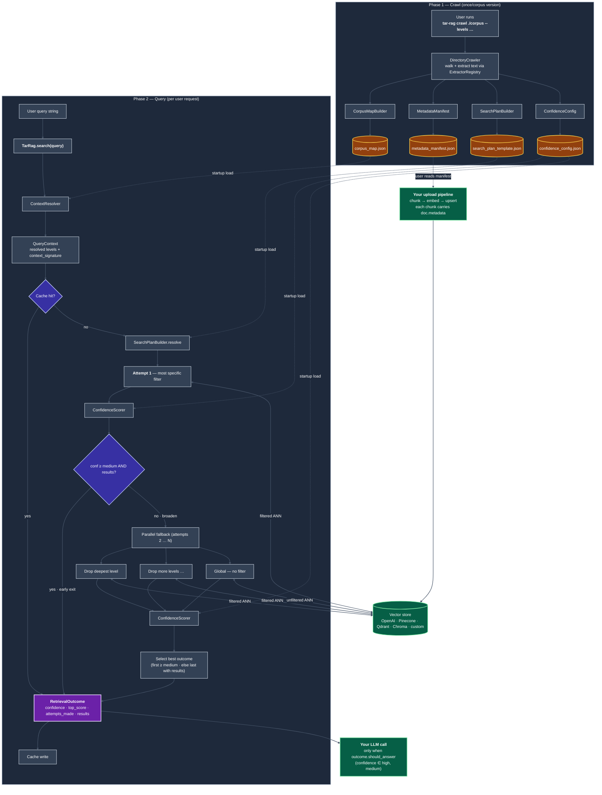

# tar-rag

**Author:** Vamsi Karnam

**License:** Apache License 2.0

**Topology-Aware Retrieval for RAG** — a vector-store-agnostic Python
library that adds structural navigation to any RAG pipeline.

---

Most RAG pipelines treat retrieval as a flat semantic search problem.
`tar-rag` adds a thin layer on top: it crawls your corpus directory,
builds a topology map of the knowledge structure, and at query time it
resolves the user's query to the relevant branch of that map and applies
it as a vector store filter — with progressive fallback from specific
to global if needed.

The result: fewer chunks reach the LLM, snippets are more precise, and
search latency on large stores drops because the ANN candidate pool is
pre-filtered.

## Status

`tar-rag` is **pre-release (v0.1.0, alpha)**. The public API is stable
enough to build against but may move before 1.0. See `CHANGELOG.md`.

## Install

```bash
# Core only (no runtime dependencies — for custom adapters / extractors)
pip install tar-rag

# With OpenAI vector store + PDF extraction
pip install "tar-rag[openai,pdf]"

# With Qdrant + PDF + DOCX
pip install "tar-rag[qdrant,pdf,docx]"

# Everything
pip install "tar-rag[all]"
```

---

## How it works

`tar-rag` separates work into two fully independent phases.

### Phase 1 — Crawl (run once per corpus version)

You point the crawler at your corpus directory. It walks the tree,
extracts text from each file via a built-in or custom extractor, builds
a topology map from the directory layout, and writes four JSON artifact
files:

| Artifact | Used by |
|---|---|
| `corpus_map.json` | `ContextResolver` at query time |
| `metadata_manifest.json` | **Your** upload pipeline (the bridge to Option A) |
| `search_plan_template.json` | The orchestrator's fallback strategy (editable) |
| `confidence_config.json` | Confidence thresholds (tunable per embedding model) |

### Phase 2 — Query (per user request)

At runtime `tar-rag` loads those four files, resolves the user's query
to a path in the topology map, and runs a vector store search with the
matching filter applied. If the result isn't confident enough,
`tar-rag` automatically broadens the filter, attempt by attempt, until
it either finds a confident answer or exhausts the chain.

`tar-rag` never owns embeddings, chunking, vector store creation, or
LLM answer generation. It only owns structural navigation.

### System architecture

The diagram below shows the full data flow end-to-end. **Solid arrows**
are the runtime execution path. **Dashed arrows** are artifact files
read into memory once at startup (or, in the case of the manifest,
read by your upload pipeline). **Diamonds** are decision points.


---

## Quickstart (three steps)

### Step 1 — Crawl your corpus

```bash
# With explicit semantic level names — recommended:
tar-rag crawl ./corpus \
    --levels category,product,sub_type \
    --output ./tar_rag_output/

# Or let the crawler infer depth from your directory layout:
tar-rag crawl ./corpus --output ./tar_rag_output/
# warning: 'auto-inferred level_names = ["level_0", "level_1", "level_2"]'
```

**About level names.** Pass `--levels` whenever you can: the names you
choose appear in the manifest, in every chunk's metadata in the vector
store, and as keys in `tar-rag`'s filter dicts. Semantic names like
`category,product,sub_type` are far easier to debug than `level_0,
level_1, level_2`. If you omit `--levels`, the crawler scans the
deepest path under the corpus root, generates generic names, and warns
you — useful for a quick first look but worth replacing with semantic
names for anything you'll keep.

You can also drive the crawler from Python:

```python
from tar_rag import DirectoryCrawler, build_artifacts

crawler = DirectoryCrawler(
    root="./corpus",
    level_names=["category", "product", "sub_type"],  # or None to auto-infer
)
documents = crawler.crawl()
bundle = build_artifacts(documents, level_names=crawler.level_names)
bundle.write("./tar_rag_output/")
```

### Optional — Tune before your first query

After Step 1 you have a fresh `tar_rag_output/confidence_config.json`.
**You do not need to touch it to use tar-rag.** The defaults are
deliberately sensible and the library works zero-config.

If you already know your embedding model clusters scores in an unusual
way, or you'd rather tune deliberately than wait to see false
positives, open `tar_rag_output/confidence_config.json` now and adjust
`medium_min`. That single knob controls the floor below which tar-rag
forwards zero chunks to your LLM — the bigger the gap between your
"good" and "weak" query scores, the more room you have to tune.

Most users skip this step on the first run, see one or two surprises,
then come back and adjust. Either path is fine. The [Tuning section
below](#step-4--tune-for-your-corpus--embedding-model) explains every
threshold and what to look at when adjusting.

### Step 2 — Upload to your vector store

`tar-rag` does **not** own upload. Your existing pipeline keeps doing
the upload — `tar-rag` just tells you what metadata to stamp on each
chunk via `metadata_manifest.json`. Read the manifest, attach
`doc.metadata` to every chunk you upsert.

#### OpenAI Vector Stores

```python
import openai
from tar_rag.manifest import MetadataManifest

client = openai.OpenAI()
manifest = MetadataManifest.load("./tar_rag_output/metadata_manifest.json")

vs = client.vector_stores.create(name=f"my-kb-{manifest.version}")
for doc in manifest:
    with open(doc.relative_path, "rb") as f:
        uploaded = client.files.create(file=f, purpose="assistants")
    client.vector_stores.files.create(
        vector_store_id=vs.id,
        file_id=uploaded.id,
        attributes={k: v for k, v in doc.metadata.items() if v is not None},
    )
```

A complete, production-ready upload script is in
[`examples/upload_openai.py`](examples/upload_openai.py). Run it with:

```bash
export OPENAI_API_KEY=<your key>
python examples/upload_openai.py \
    --manifest ./tar_rag_output/metadata_manifest.json \
    --corpus   ./corpus \
    --output   ./tar_rag_output/active_state.json
```

See [`examples/integration_openai.md`](examples/integration_openai.md)
for the full walkthrough.

#### Pinecone

```python
from pinecone import Pinecone
from tar_rag.manifest import MetadataManifest
import your_pipeline  # YOUR chunker + embedder

pc = Pinecone(api_key="...")
index = pc.Index("my-index")
manifest = MetadataManifest.load("./tar_rag_output/metadata_manifest.json")

for doc in manifest:
    text = your_pipeline.extract_text(doc.relative_path)
    chunks = your_pipeline.chunk(text)
    embeddings = your_pipeline.embed(chunks)

    vectors = [
        {
            "id": f"{doc.doc_id}_chunk_{i}",
            "values": emb,
            "metadata": {
                **doc.metadata,    # <-- tar-rag's contribution
                "text": chunk,
                "filename": doc.filename,
            },
        }
        for i, (chunk, emb) in enumerate(zip(chunks, embeddings))
    ]
    index.upsert(vectors=vectors)
```

#### Qdrant

```python
from qdrant_client import QdrantClient
from qdrant_client.models import PointStruct, VectorParams, Distance
from tar_rag.manifest import MetadataManifest
import your_pipeline

client = QdrantClient(url="http://localhost:6333")
manifest = MetadataManifest.load("./tar_rag_output/metadata_manifest.json")

client.create_collection(
    "my-kb",
    vectors_config=VectorParams(size=1536, distance=Distance.COSINE),
)

# Payload indexes per level — this is what makes filtered search fast.
for level in manifest.level_names:
    client.create_payload_index("my-kb", field_name=level, field_schema="keyword")

points, point_id = [], 0
for doc in manifest:
    chunks = your_pipeline.chunk(your_pipeline.extract_text(doc.relative_path))
    for chunk, emb in zip(chunks, your_pipeline.embed(chunks)):
        points.append(PointStruct(
            id=point_id,
            vector=emb,
            payload={**doc.metadata, "text": chunk, "filename": doc.filename},
        ))
        point_id += 1

client.upsert("my-kb", points=points)
```

#### Chroma

```python
import chromadb
from tar_rag.manifest import MetadataManifest
import your_pipeline

collection = chromadb.Client().create_collection("my-kb")
manifest = MetadataManifest.load("./tar_rag_output/metadata_manifest.json")

for doc in manifest:
    chunks = your_pipeline.chunk(your_pipeline.extract_text(doc.relative_path))
    embeddings = your_pipeline.embed(chunks)
    collection.add(
        ids=[f"{doc.doc_id}_chunk_{i}" for i in range(len(chunks))],
        embeddings=embeddings,
        documents=chunks,
        # Chroma rejects None metadata values — strip them.
        metadatas=[{k: v for k, v in doc.metadata.items() if v is not None}
                   for _ in chunks],
    )
```

### Step 3 — Query through tar-rag

Identical user-facing API regardless of which vector store sits
underneath:

```python
from tar_rag import TarRag
from tar_rag.adapters import OpenAIVectorStoreAdapter  # or Pinecone / Qdrant / Chroma
import openai

tar = TarRag.from_artifacts("./tar_rag_output/")
tar.set_adapter(OpenAIVectorStoreAdapter(
    client=openai.OpenAI(),
    vector_store_id="vs-abc123",
    top_k=6,
))

result = tar.search("What does asyncio.TaskGroup do in the source code?")
print(result.confidence)      # "high" | "medium" | "low" | "none"
print(result.top_score)       # e.g. 0.87
print(result.attempts_made)   # how deep into the fallback chain we went
print(result.reason)          # "resolved_context" | "<level>_only" | "drop_<level>" | "global_fallback"

for chunk in result.results:
    print(chunk.score, chunk.snippet[:200])
    print(chunk.metadata)     # carries the level values + doc_id + source_path
```

When the resolver can't pin down which branch the user means, `result`
carries a clarification prompt you can show to your user:

```python
if result.needs_clarification:
    print(result.clarification["prompt"])
    for option in result.clarification["options"]:
        print(option["id"], option["label"])
```

To resume after the user picks an option, pass the prior turn back as
conversation history:

```python
from tar_rag import ConversationTurn

conversation = [
    ConversationTurn(role="user", content="original question"),
    ConversationTurn(
        role="assistant",
        content=result.clarification["prompt"],
        type="clarification",
        metadata={
            "options": result.clarification["options"],
            "original_query": result.clarification["original_query"],
        },
    ),
]
follow_up = tar.search(user_reply, conversation=conversation)
```

---

## Step 4 — Tune for your corpus + embedding model

The values that ship with `tar-rag` are **default tuning values** —
sensible starting points calibrated against OpenAI's
`text-embedding-3-large`, not optimal values for any particular
corpus. Different embedding models produce different score
distributions, and different corpora put different floors on what
"weakly related" looks like — so you'll want to tune the thresholds
once after seeing a few real queries from your own data.

All tunable parameters live in **plain JSON or function arguments**.
No code changes required.

### Confidence thresholds — `tar_rag_output/confidence_config.json`

This is the file you'll most likely edit. It controls when retrieval
results are classified as `high` / `medium` / `low` / `none`, which in
turn controls **whether tar-rag forwards the chunks to your LLM or
gates them out**.

| Parameter | Default | What it does | When to **raise** | When to **lower** |
|---|---|---|---|---|
| `high_single` | `0.78` | Top result's score ≥ this → tier = **high** by itself. | If your model regularly scores irrelevant chunks at 0.78+ (overconfident defaults). | If your model clusters good chunks at 0.6-0.7 (sentence-transformers families often do). |
| `high_combo` | `0.68` | Top ≥ this **AND** second ≥ `high_combo_second` → also **high**. Catches "consistent moderate" cases the single-rule misses. | To require stronger agreement before promoting to high. | If your model rarely produces two-result consensus even when answers are obvious. |
| `high_combo_second` | `0.55` | The 2nd-place score threshold paired with `high_combo`. | Together with `high_combo` if you want stricter consensus. | If 2nd-place scores typically fall off a cliff in your store. |
| `medium_min` | `0.58` | Top score ≥ this → **medium**. **Below this → low / none → tar-rag forwards 0 chunks to your LLM.** This is the token-saving gate. | To be stricter about what reaches your LLM (fewer false positives, slightly higher gating). | To be more permissive (fewer over-gated true-positives). |

Rules in priority order: `high_single` → `high_combo` → `medium_min` → otherwise low / none.

**How to know what to set them to** — run 5–10 representative queries
of each category through `tar.search(...)` and look at `result.top_score`:

```python
for query in your_canonical_queries:
    r = tar.search(query)
    print(f"{query[:40]:40} {r.confidence:6} top={r.top_score:.2f}")
```

You'll see the score distribution split naturally. Set `medium_min`
between the lowest "should-pass" query's top score and the highest
"should-be-gated" query's top score. The other thresholds usually fall
into place once `medium_min` is right.

A concrete worked example with numbers — including a real false
positive caught by tuning `medium_min` from `0.58` to `0.72` — lives
in [`benchmark.md`](benchmark.md).

### Retrieval behaviour — adapter and orchestrator arguments

| Parameter | Where | Default | What it does | When to tune |
|---|---|---|---|---|
| `top_k` | `OpenAIVectorStoreAdapter(top_k=...)` (and every other adapter) | `6` | How many chunks each search attempt returns. Applied per attempt — so for a 4-attempt fallback chain, the orchestrator may evaluate up to `4 * top_k` chunks before settling on the best outcome. | Raise if your downstream LLM has a large context window and you want more recall. Lower if you want faster, cheaper queries (most vector stores scale latency with `top_k`). |
| `parallel_fallback` | `TarRag.from_artifacts(..., parallel_fallback=...)` | `True` | Whether attempts 2…N run in parallel after attempt 1 fails. | Set `False` for sequential fallback when debugging (easier to read logs) or when your adapter doesn't tolerate concurrent calls. |
| `cache_root` | `TarRag.from_artifacts(..., cache_root=...)` | `None` (in-memory only) | Directory on disk for the retrieval cache. With a path set, cache survives process restarts. Keyed by `(query, corpus_version, context_signature)` — re-crawling automatically invalidates. | Set to a project-local path in production; leave unset for one-off scripts. |

### Search plan — `tar_rag_output/search_plan_template.json`

The orchestrator reads this file (if present) for the fallback chain.
You can edit it directly to:

- **Disable specific fallback levels** (e.g. remove the global attempt
  if you'd rather return "no answer" than risk an off-topic result).
- **Reorder attempts** if some level combinations are more meaningful
  to try first for your corpus.
- **Toggle `allow_broaden`** on any attempt to make it terminal — the
  orchestrator stops broadening past an attempt with `allow_broaden:
  false`.

If the file is absent at query time, `tar-rag` regenerates the chain
dynamically from `level_names` — so deleting the file effectively
"resets to defaults."

### When to NOT tune

If your benchmark numbers look reasonable on the defaults, don't tune.
The defaults aim to be the right starting point for most users on
`text-embedding-3-large`; over-tuning to a small query set risks
hand-fitting and won't generalise.

---

## Async support

Every public entry point has a native async counterpart. The async
invariant is:

> **Whatever you can do with `tar-rag` synchronously, you can do with
> the same arguments asynchronously by prefixing the method with `a`.**

So:

| Sync | Async |
|---|---|
| `tar.search(query)` | `tar.asearch(query)` |
| `orchestrator.execute(ctx, attempts)` | `orchestrator.aexecute(ctx, attempts)` |
| `adapter.search(query, filters, top_k)` | `adapter.asearch(query, filters, top_k)` |
| `cache.get(key)` / `cache.set(key, value)` | `cache.aget(key)` / `cache.aset(key, value)` |

```python
result = await tar.asearch("What does asyncio.TaskGroup do in the source code?")
```

**What the async path does under the hood:**

- For each fallback attempt, the orchestrator calls `adapter.asearch(...)`.
- The default `asearch` on `AbstractVectorStoreAdapter` runs the sync
  `search()` in a worker thread via `asyncio.to_thread`. That means
  every adapter is async-compatible out of the box even if its
  underlying client is sync-only.
- Adapters whose client has a native async API (e.g.
  `openai.AsyncOpenAI`, `AsyncQdrantClient`) can override `asearch`
  for true async I/O. The bundled `OpenAIVectorStoreAdapter` and
  `QdrantAdapter` accept an optional `async_client` argument and use it
  if provided.
- Parallel fallback uses `asyncio.gather` on the async path and
  `concurrent.futures.ThreadPoolExecutor` on the sync path — the
  fallback shape and ordering are identical.

In short: `asearch` and `search` produce equivalent `RetrievalOutcome`
results given equivalent inputs (modulo wall-time differences from the
underlying I/O). The orchestrator's decision logic — confidence
gating, early exit, progressive broadening, cache lookup — is the same.

---

## Vector store invariance

`tar-rag` knows nothing about your chunker, your embedder, or your
vector store internals. Its three contracts are:

1. **You stamp `doc.metadata` from `metadata_manifest.json` onto every
   chunk during upload.** That's the entire upload-side contract.
2. **You provide an `AbstractVectorStoreAdapter` subclass that
   translates `tar-rag`'s filter dict to your store's native filter
   format.** Four adapters ship in the box (OpenAI, Pinecone, Qdrant,
   Chroma); a custom adapter is one class, one method.
3. **Your adapter returns `SearchResult` instances** (a thin dataclass
   carrying `score`, `snippet`, `metadata`, `doc_id`, `filename`).

The filter format `tar-rag` produces:

```python
None                                                           # global / unfiltered
{"type": "eq", "key": "product", "value": "datawell"}          # single level
{"type": "and", "filters": [                                   # multi-level
    {"type": "eq", "key": "category", "value": "instruments"},
    {"type": "eq", "key": "product", "value": "datawell"},
]}
```

Custom adapter sketch:

```python
from tar_rag.adapters import AbstractVectorStoreAdapter
from tar_rag.models import SearchResult

class MyStoreAdapter(AbstractVectorStoreAdapter):
    def search(self, query, filters, top_k):
        native_filter = self._translate(filters)
        rows = self._client.query(query=query, filter=native_filter, top_k=top_k)
        return [
            SearchResult(
                score=row.score,
                snippet=row.text[:1500],
                metadata=row.metadata,
                doc_id=row.metadata.get("doc_id"),
                filename=row.metadata.get("filename"),
            )
            for row in rows
        ]

    def _translate(self, filters):
        if filters is None:
            return None
        if filters["type"] == "eq":
            return my_store_eq(filters["key"], filters["value"])
        if filters["type"] == "and":
            return my_store_and([self._translate(f) for f in filters["filters"]])
```

The async path is taken care of for you — `asearch` defaults to
running `search` in a thread.

---

## Supported file types out of the box

- PDF (`pypdf`, optional extra)
- DOCX (`python-docx`, optional extra)
- Plaintext: `.txt`, `.md`, `.py`, `.c`, `.cpp`, `.h`, `.hpp`, `.js`, `.ts`, `.css`, `.rst`
- HTML (stdlib `html.parser`)
- JSON, CSV (stdlib)

All extractors are pluggable via the `TextExtractor` interface —
override the registry to use `pdfplumber`, `pymupdf`, `unstructured`,
or any custom extractor.

---

## Project layout

```
tar_rag/
├── __init__.py                # public API surface
├── models.py                  # DocumentRecord, QueryContext, RetrievalOutcome, ...
├── crawler.py                 # DirectoryCrawler + HierarchyExtractor
├── corpus_map.py              # CorpusMapBuilder
├── manifest.py                # MetadataManifest (Option A bridge)
├── search_plan.py             # SearchPlanBuilder + SearchPlanTemplate
├── confidence.py              # ConfidenceConfig + ConfidenceScorer
├── context_resolver.py        # ContextResolver (query → topology node)
├── retrieval.py               # RetrievalOrchestrator (sync + async)
├── cache.py                   # RetrievalCache (in-memory + disk)
├── facade.py                  # TarRag (the high-level entry point)
├── artifacts.py               # build_artifacts() — produces all 4 files
├── cli.py                     # `tar-rag` command-line entry point
├── extractors/                # PDF, DOCX, plaintext, HTML, JSON, CSV, registry
└── adapters/                  # OpenAI, Pinecone, Qdrant, Chroma, in-memory, base
```

---

## Appendix — FAQs & Findings

The integration of TAR-RAG has to be carefully built
not to leak tokens. The three questions below cover the most common
places that hidden waste could sneak in, plus four anti-patterns that
defeat the library's purpose if you let them.

### Three places token waste could hide, and the answer to each

**1. "Does the `corpus_map` get inlined into the LLM prompt anywhere?"**

No. Not in tar-rag, not by accident, not as a default. It's loaded
from disk into a Python dict at startup. The only code paths that
touch it are `ContextResolver` (which reads it to match level names
against the query) and the manifest validator. No code path
serialises it back to a string for any external API. You can grep for
`corpus_map` across the codebase — every reference is in-memory.

**2. "Does the manifest metadata stamped on chunks get sent to the LLM with the snippets?"**

Only if your downstream code includes it. tar-rag returns
`result.results[i]` with a `metadata` dict, but it does **not**
dictate how you build your LLM prompt. The decision is yours. The two
common patterns:

```python
# Pattern A — snippets only (tighter)
prompt = "\n\n".join(r.snippet for r in result.results)

# Pattern B — snippets + source pointer (gives the LLM provenance, costs a bit)
prompt = "\n\n".join(
    f"[source: {r.metadata['source_path']}]\n{r.snippet}"
    for r in result.results
)
```

Pattern A adds zero metadata tokens. Pattern B adds ~30 tokens per
chunk × 6 chunks ≈ 180 tokens per query (~7% overhead on a 2,500-token
prompt). Most teams use Pattern B because traceable answers are worth
the small cost, but it's your call. If your goal is purely
minimum-tokens, use Pattern A.

**3. "Does the query enrichment inflate the embedding cost?"**

Negligible. tar-rag prepends resolved level values to your query
before embedding — typically 3–10 extra tokens. At
`text-embedding-3-large` pricing (~$0.13 per million tokens) this is
fractions of a cent per million queries. The reason it's there: the
embedding model uses the prepended context to produce a more
discriminative vector, which directly improves the top-K precision
shown in the benchmark. Cost-to-benefit is overwhelmingly in favour.

### What to watch out in your integrations:

These are the patterns that *would* defeat the purpose of the
library, ranked by likelihood:

**1. Stuffing `chunk.metadata` into the LLM prompt verbosely.**
If you format it as JSON-blobs-per-chunk instead of a short source
pointer, you can easily 2× your prompt token count. Use Pattern B
with one short key (`source_path`) or, even better, append the source
pointer as a footnote *after* the snippet only when the user clicks
"view sources."

**2. Forwarding chunks even at low confidence "just in case."**
This undoes the confidence gate entirely. If
`result.confidence in {"low", "none"}`, the correct behaviour is "tell
the user no good answer was found" — not "send the weak chunks
anyway." The library trusts you to honour the gate; if you bypass it,
the structural win (zero chunks forwarded on out-of-corpus queries vs
baseline's full top-K) disappears.

**3. Caching the wrong layer.**
If you cache LLM responses keyed by raw user query, two queries that
resolve to the same topology node will miss the cache. tar-rag's
`RetrievalCache` is keyed by `(query, corpus_version, context_signature)`
— the signature being the resolved-levels join. Two phrasings of the
same underlying question share a cache bucket because they share a
signature. Make sure your application caching mirrors that, or use
tar-rag's cache directly.

**4. Re-uploading on every crawl.**
The `corpus_version` is a deterministic SHA-256 of the document
checksums; if no documents changed, the version doesn't change. Your
upload script should check `manifest.version` against the last
uploaded version and skip the upload if they match.
---
