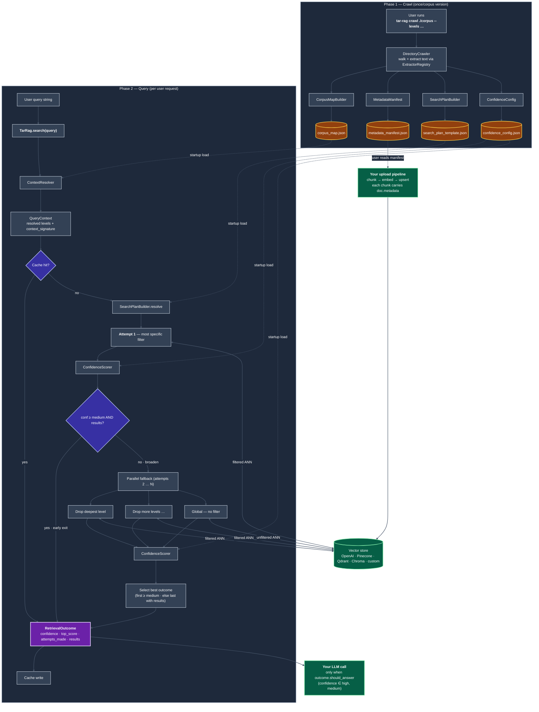

# tar-rag — How-to guide

This guide is for developers integrating `tar-rag` into a real pipeline.
For the high-level pitch, the heat-map metaphor, and the use-case list,
see [`README.md`](../README.md). For measured benchmark numbers, see
[`benchmarks/benchmark.md`](../benchmarks/benchmark.md).

---

## Table of contents

1. [Prerequisites](#prerequisites)
2. [Quickstart (three steps)](#quickstart-three-steps)
   - [Step 1 — Crawl your corpus](#step-1--crawl-your-corpus)
   - [Step 2 — Upload to your vector store](#step-2--upload-to-your-vector-store)
   - [Step 3 — Query through tar-rag](#step-3--query-through-tar-rag)
3. [Tuning for your corpus + embedding model](#tuning-for-your-corpus--embedding-model)
4. [Custom vector store adapter](#custom-vector-store-adapter)
5. [Custom extractors](#custom-extractors)
6. [Async usage](#async-usage)
7. [Clarification flow (multi-turn)](#clarification-flow-multi-turn)
8. [Architecture detail](#architecture-detail)

---

## Prerequisites

```bash
pip install tar-rag
```

The default install includes every bundled vector-store adapter (OpenAI,
Pinecone, Qdrant, Chroma) and every file extractor (PDF, DOCX). If you
only need a subset of adapters in production and want a leaner image, you
can uninstall the unused SDKs after install — `tar-rag` lazy-imports each
adapter and degrades gracefully when one is missing.

---

## Quickstart (three steps)

### Step 1 — Crawl your corpus

```bash
# With explicit semantic level names — recommended:
tar-rag crawl ./corpus \
    --levels category,product,sub_type \
    --output ./tar_rag_output/

# Or let the crawler infer depth from your directory layout:
tar-rag crawl ./corpus --output ./tar_rag_output/
# warning: 'auto-inferred level_names = ["level_0", "level_1", "level_2"]'
```

**About level names.** Pass `--levels` whenever you can: the names you
choose appear in the manifest, in every chunk's metadata in the vector
store, and as keys in `tar-rag`'s filter dicts. Semantic names like
`category,product,sub_type` are far easier to debug than `level_0,
level_1, level_2`. If you omit `--levels`, the crawler scans the deepest
path under the corpus root, generates generic names, and warns you —
useful for a quick first look but worth replacing with semantic names for
anything you'll keep.

The crawl writes four JSON artifacts:

| Artifact | Used by |
|---|---|
| `corpus_map.json` | `ContextResolver` at query time |
| `metadata_manifest.json` | **Your** upload pipeline (Step 2) |
| `search_plan_template.json` | The orchestrator's fallback strategy (editable) |
| `confidence_config.json` | Confidence thresholds (tunable per embedding model) |

You can also drive the crawler from Python:

```python
from tar_rag import DirectoryCrawler, build_artifacts

crawler = DirectoryCrawler(
    root="./corpus",
    level_names=["category", "product", "sub_type"],  # or None to auto-infer
)
documents = crawler.crawl()
bundle = build_artifacts(documents, level_names=crawler.level_names)
bundle.write("./tar_rag_output/")
```

### Step 2 — Upload to your vector store

`tar-rag` does **not** own upload. Your existing pipeline keeps doing the
upload — `tar-rag` just tells you what metadata to stamp on each chunk
via `metadata_manifest.json`. Read the manifest, attach `doc.metadata` to
every chunk you upsert.

#### OpenAI Vector Stores

```python
import openai
from tar_rag.manifest import MetadataManifest

client = openai.OpenAI()
manifest = MetadataManifest.load("./tar_rag_output/metadata_manifest.json")

vs = client.vector_stores.create(name=f"my-kb-{manifest.version}")
for doc in manifest:
    with open(doc.relative_path, "rb") as f:
        uploaded = client.files.create(file=f, purpose="assistants")
    client.vector_stores.files.create(
        vector_store_id=vs.id,
        file_id=uploaded.id,
        attributes={k: v for k, v in doc.metadata.items() if v is not None},
    )
```

A complete, production-ready upload script lives next to this guide as
[`upload_openai.py`](upload_openai.py). Run it (from the repo root) with:

```bash
export OPENAI_API_KEY=<your key>
python examples/upload_openai.py \
    --manifest ./tar_rag_output/metadata_manifest.json \
    --corpus   ./corpus \
    --output   ./tar_rag_output/active_state.json
```

See [`integration_openai.md`](integration_openai.md) for the OpenAI
example and [`integration_other.md`](integration_other.md) for Pinecone,
Qdrant, and Chroma.

### Step 3 — Query through tar-rag

Identical user-facing API regardless of which vector store sits
underneath:

```python
from tar_rag import TarRag
from tar_rag.adapters import OpenAIVectorStoreAdapter  # or Pinecone / Qdrant / Chroma
import openai

tar = TarRag.from_artifacts("./tar_rag_output/")
tar.set_adapter(OpenAIVectorStoreAdapter(
    client=openai.OpenAI(),
    vector_store_id="vs-abc123",
    top_k=6,
))

result = tar.search("How does the OAuth token refresh flow work?")
print(result.confidence)      # "high" | "medium" | "low" | "none"
print(result.top_score)       # e.g. 0.87
print(result.attempts_made)   # how deep into the fallback chain we went
print(result.reason)          # "resolved_context" | "<level>_only" | "drop_<level>" | "global_fallback"

for chunk in result.results:
    print(chunk.score, chunk.snippet[:200])
    print(chunk.metadata)     # carries the level values + doc_id + source_path
```

---

## Tuning for your corpus + embedding model

The values that ship with `tar-rag` are **default tuning values** —
sensible starting points calibrated against OpenAI's
`text-embedding-3-large`, not optimal values for any particular corpus.
Different embedding models produce different score distributions, and
different corpora put different floors on what "weakly related" looks
like — so you'll want to tune the thresholds once after seeing a few real
queries from your own data.

All tunable parameters live in **plain JSON or function arguments**. No
code changes required.

### Confidence thresholds — `tar_rag_output/confidence_config.json`

This is the file you'll most likely edit. It controls when retrieval
results are classified as `high` / `medium` / `low` / `none`, which in
turn controls **whether `tar-rag` forwards the chunks to your LLM or
gates them out**.

| Parameter | Default | What it does | When to **raise** | When to **lower** |
|---|---|---|---|---|
| `high_single` | `0.78` | Top result's score ≥ this → tier = **high** by itself. | If your model regularly scores irrelevant chunks at 0.78+ (overconfident defaults). | If your model clusters good chunks at 0.6-0.7 (sentence-transformers families often do). |
| `high_combo` | `0.68` | Top ≥ this **AND** second ≥ `high_combo_second` → also **high**. Catches "consistent moderate" cases the single-rule misses. | To require stronger agreement before promoting to high. | If your model rarely produces two-result consensus even when answers are obvious. |
| `high_combo_second` | `0.55` | The 2nd-place score threshold paired with `high_combo`. | Together with `high_combo` if you want stricter consensus. | If 2nd-place scores typically fall off a cliff in your store. |
| `medium_min` | `0.58` | Top score ≥ this → **medium**. **Below this → low / none → `tar-rag` forwards 0 chunks to your LLM.** This is the token-saving gate. | To be stricter about what reaches your LLM (fewer false positives, slightly higher gating). | To be more permissive (fewer over-gated true-positives). |

Rules in priority order: `high_single` → `high_combo` → `medium_min` →
otherwise low / none.

**How to know what to set them to** — run 5–10 representative queries of
each category through `tar.search(...)` and look at `result.top_score`:

```python
for query in your_canonical_queries:
    r = tar.search(query)
    print(f"{query[:40]:40} {r.confidence:6} top={r.top_score:.2f}")
```

You'll see the score distribution split naturally. Set `medium_min`
between the lowest "should-pass" query's top score and the highest
"should-be-gated" query's top score. The other thresholds usually fall
into place once `medium_min` is right.

A concrete worked example with numbers — including a real false positive
caught by tuning `medium_min` from `0.58` to `0.72` — lives in
[`benchmarks/benchmark.md`](../benchmarks/benchmark.md).

### Retrieval behaviour — adapter and orchestrator arguments

| Parameter | Where | Default | What it does | When to tune |
|---|---|---|---|---|
| `top_k` | `OpenAIVectorStoreAdapter(top_k=...)` (and every other adapter) | `6` | How many chunks each search attempt returns. Applied per attempt — so for a 4-attempt fallback chain, the orchestrator may evaluate up to `4 * top_k` chunks before settling on the best outcome. | Raise if your downstream LLM has a large context window and you want more recall. Lower if you want faster, cheaper queries (most vector stores scale latency with `top_k`). |
| `parallel_fallback` | `TarRag.from_artifacts(..., parallel_fallback=...)` | `True` | Whether attempts 2…N run in parallel after attempt 1 fails. | Set `False` for sequential fallback when debugging (easier to read logs) or when your adapter doesn't tolerate concurrent calls. |
| `cache_root` | `TarRag.from_artifacts(..., cache_root=...)` | `None` (in-memory only) | Directory on disk for the retrieval cache. With a path set, cache survives process restarts. Keyed by `(query, corpus_version, context_signature)` — re-crawling automatically invalidates. | Set to a project-local path in production; leave unset for one-off scripts. |

### Search plan — `tar_rag_output/search_plan_template.json`

The orchestrator reads this file (if present) for the fallback chain. You
can edit it directly to:

- **Disable specific fallback levels** (e.g. remove the global attempt if
  you'd rather return "no answer" than risk an off-topic result).
- **Reorder attempts** if some level combinations are more meaningful to
  try first for your corpus.
- **Toggle `allow_broaden`** on any attempt to make it terminal — the
  orchestrator stops broadening past an attempt with
  `allow_broaden: false`.

If the file is absent at query time, `tar-rag` regenerates the chain
dynamically from `level_names` — so deleting the file effectively "resets
to defaults."

### When to NOT tune

If your benchmark numbers look reasonable on the defaults, don't tune.
The defaults aim to be the right starting point for most users on
`text-embedding-3-large`; over-tuning to a small query set risks
hand-fitting and won't generalise.

---

## Custom vector store adapter

`tar-rag` produces filter dicts in one of three shapes:

```python
None                                                           # global / unfiltered
{"type": "eq", "key": "product", "value": "datawell"}          # single level
{"type": "and", "filters": [                                   # multi-level
    {"type": "eq", "key": "category", "value": "instruments"},
    {"type": "eq", "key": "product", "value": "datawell"},
]}
```

An adapter is one class with one method that translates this dict to your
store's native filter format and returns `SearchResult` instances:

```python
from tar_rag.adapters import AbstractVectorStoreAdapter
from tar_rag.models import SearchResult

class MyStoreAdapter(AbstractVectorStoreAdapter):
    def search(self, query, filters, top_k):
        native_filter = self._translate(filters)
        rows = self._client.query(query=query, filter=native_filter, top_k=top_k)
        return [
            SearchResult(
                score=row.score,
                snippet=row.text[:1500],
                metadata=row.metadata,
                doc_id=row.metadata.get("doc_id"),
                filename=row.metadata.get("filename"),
            )
            for row in rows
        ]

    def _translate(self, filters):
        if filters is None:
            return None
        if filters["type"] == "eq":
            return my_store_eq(filters["key"], filters["value"])
        if filters["type"] == "and":
            return my_store_and([self._translate(f) for f in filters["filters"]])
```

The async path is taken care of for you — `asearch` defaults to running
`search` in a thread. Override it only if your client has a native async
API and you want true async I/O.

---

## Custom extractors

Each file type is handled by a `TextExtractor` subclass registered to one
or more extensions. To swap in `pdfplumber` for PDFs, or add a brand-new
format:

```python
from tar_rag import DirectoryCrawler
from tar_rag.extractors.base import TextExtractor

class PdfPlumberExtractor(TextExtractor):
    def extract(self, path):
        import pdfplumber
        with pdfplumber.open(path) as pdf:
            return "\n".join((page.extract_text() or "") for page in pdf.pages)

crawler = DirectoryCrawler(root="./corpus", level_names=["category", "product"])
crawler.extractors.register(".pdf", PdfPlumberExtractor())
documents = crawler.crawl()
```

The registry is mutable — call `register()` to add or replace an
extension, `deregister()` to remove one, `supported_extensions()` to list
them.

---

## Async usage

Every public entry point has a sync and async form, with the same
arguments and the same return type:

| Sync | Async |
|---|---|
| `tar.search(query)` | `tar.asearch(query)` |
| `orchestrator.execute(ctx, attempts)` | `orchestrator.aexecute(ctx, attempts)` |
| `adapter.search(query, filters, top_k)` | `adapter.asearch(query, filters, top_k)` |
| `cache.get(key)` / `cache.set(key, value)` | `cache.aget(key)` / `cache.aset(key, value)` |

```python
result = await tar.asearch("How does the OAuth token refresh flow work?")
```

**Under the hood:**

- For each fallback attempt, the orchestrator calls `adapter.asearch(...)`.
- The default `asearch` on `AbstractVectorStoreAdapter` runs the sync
  `search()` in a worker thread via `asyncio.to_thread`. Every adapter is
  async-compatible out of the box even if its underlying client is
  sync-only.
- Adapters whose client has a native async API (e.g.
  `openai.AsyncOpenAI`, `AsyncQdrantClient`) can override `asearch` for
  true async I/O. The bundled `OpenAIVectorStoreAdapter` and
  `QdrantAdapter` accept an optional `async_client` argument and use it
  if provided.
- Parallel fallback uses `asyncio.gather` on the async path and
  `concurrent.futures.ThreadPoolExecutor` on the sync path — the fallback
  shape and ordering are identical.

`asearch` and `search` produce equivalent `RetrievalOutcome` results
given equivalent inputs (modulo wall-time differences from the underlying
I/O). The orchestrator's decision logic — confidence gating, early exit,
progressive broadening, cache lookup — is the same.

---

## Clarification flow (multi-turn)

When the resolver can't pin down which branch the user means, `result`
carries a clarification prompt you can show to your user:

```python
if result.needs_clarification:
    print(result.clarification["prompt"])
    for option in result.clarification["options"]:
        print(option["id"], option["label"])
```

To resume after the user picks an option, pass the prior turn back as
conversation history:

```python
from tar_rag import ConversationTurn

conversation = [
    ConversationTurn(role="user", content="original question"),
    ConversationTurn(
        role="assistant",
        content=result.clarification["prompt"],
        type="clarification",
        metadata={
            "options": result.clarification["options"],
            "original_query": result.clarification["original_query"],
        },
    ),
]
follow_up = tar.search(user_reply, conversation=conversation)
```

---

## Architecture detail

The full data flow end-to-end, including the crawl phase, the four
artifact files, and the parallel fallback chain.

**Solid arrows** are the runtime execution path. **Dashed arrows** are
artifact files read into memory once at startup (or, in the case of the
manifest, read by your upload pipeline). **Diamonds** are decision
points.


